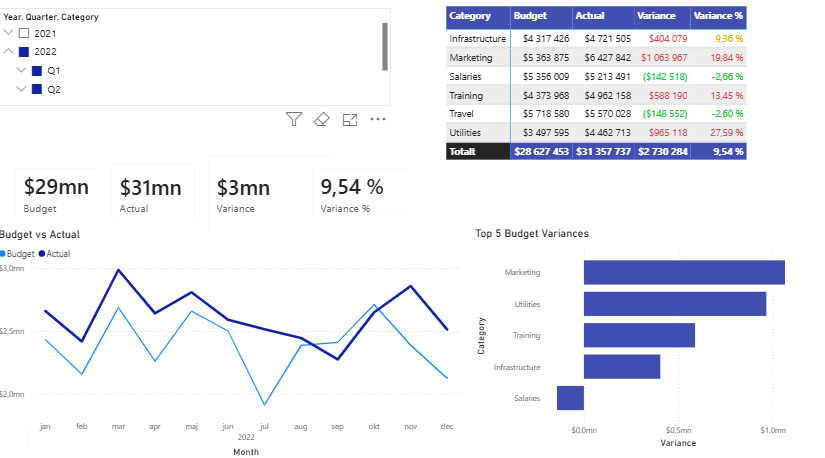

# Budgetanalys
I detta projekt har jag sammanställt hur mycket pengar varje avdelning i ett företag har spenderat, samt hur stor avvikelsen är jämfört med budgeten. 
Rådatan är en excel-fil jag hämtat via Kaggle, som innehåller transaktionsdata.

## 🏗️ Arkitektur & Dataflöde
I detta projekt har två olika tillvägagångssätt använts för att transformera och visualisera datan:

### Spår 1: Databas & Analys 
*   **Rådata (xlsx):** Excel-fil innehållande ekonomisk transaktionsdata.
*   **Python (Tvätt):** Skript som tvättar datan och förbereder den för databasen.
*   **MySQL (Lagring):** Den tvättade datan lagras i en databas.
*   **SQL/Python (Analys):** Skript som aggregerar och beräknar den totala budgeten och de ackumulerade avvikelserna per avdelning.

### Spår 2: Visualisering & BI (Power BI)
*   Datan har även importerats separat till Power BI för att skapa en interaktiv rapportvy.

*   ## 🏆 Resultat & Visualisering
*   **Interaktiv Power BI-rapport:** All sammanställd data visualiseras nu i en tydlig dashboard,  vilket gör det enkelt att filtrera fram de avdelningar som har störst budgetavvikelser.
*   **Automatisk fellista:** Systemet flaggar automatiskt de största avvikelserna över tid, vilket sparar massor av tid jämfört med manuellt letande i Excel-rader.

### Rapportvy (Power BI)

